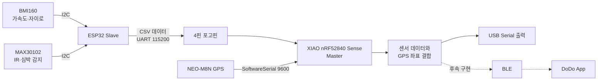

## ✨ 임베디드 주요 기능 (Key Embedded Features)

DoDo 임베디드 시스템은 **Master-Slave 2보드 구조**로 구성되며, 반려동물 웨어러블 디바이스에서 위치·활동·생체 데이터를 수집하고 하나의 데이터로 결합합니다.

- **✅ 활동 및 생체 데이터 수집**
  > Slave 보드인 ESP32가 BMI160으로 가속도·자이로 데이터를 수집합니다. <br>
  > MAX30102의 IR 값을 읽고 심박 신호 감지 여부를 계산합니다.

- **✅ GPS 위치 데이터 수집**
  > Master 보드인 XIAO nRF52840 Sense가 NEO-M8N GPS의 NMEA 데이터를 수신합니다. <br>
  > TinyGPSPlus를 이용하여 위도와 경도를 파싱합니다.

- **✅ Master-Slave UART 통신**
  > Slave가 센서 데이터를 CSV 형식으로 구성하여 포고핀 UART로 Master에 전송합니다. <br>
  > Master는 수신한 센서 데이터 뒤에 GPS 위도·경도를 결합합니다.

- **✅ 센서 및 통신 설정 분리**
  > Master와 Slave의 핀 번호, Baud Rate 및 통신 설정을 별도 헤더 파일에서 관리합니다. <br>
  > 하드웨어 배선 변경 시 핀 설정 파일만 수정할 수 있도록 구성합니다.

- **✅ 디버그 데이터 출력**
  > 각 보드는 USB Serial을 통해 센서 초기화 상태와 수집 데이터를 출력합니다. <br>
  > GPS 위치를 수신하지 못한 경우 위도와 경도를 `NA,NA`로 표시합니다.

- **✅ 전원 관리**
  > XIAO nRF52840 Sense의 충전 회로를 이용하여 LiPo 배터리의 충전을 관리합니다. <br>
  > Slave 보드는 별도 배터리 없이 포고핀을 통해 Master로부터 전원을 공급받는 구조입니다.

- **🔜 BLE 데이터 전송**
  > Master에서 결합한 데이터를 BLE로 DoDo 앱에 전송하는 기능은 후속 단계에서 구현할 예정입니다.

<br>

## ⚙️ 기술 스택 (Tech Stack)

<div align="center">

### Boards & Development

<p>


</p>

### Communication

<p>


</p>

### Sensors

<p>


</p>

### Libraries

<p>


</p>

</div>

<br>

## 🤖 임베디드 아키텍처 (Embedded System Architecture)

DoDo 임베디드 시스템은 센서 데이터 수집을 담당하는 Slave와 위치 데이터 수집 및 데이터 결합을 담당하는 Master로 구성됩니다.



<br>

## 🔄 데이터 처리 흐름 (Data Flow)

```text
1. ESP32가 BMI160과 MAX30102를 초기화합니다.
2. BMI160에서 가속도와 자이로 X·Y·Z축 데이터를 읽습니다.
3. MAX30102에서 IR 값과 심박 신호 감지 결과를 읽습니다.
4. 수집한 값을 CSV 형식으로 구성합니다.
5. Slave가 UART를 통해 CSV 데이터를 Master로 전송합니다.
6. Master는 NEO-M8N의 NMEA 데이터를 지속적으로 파싱합니다.
7. Slave 데이터 한 줄을 수신하면 현재 GPS 좌표를 결합합니다.
8. GPS 위치가 유효하지 않으면 좌표 대신 NA,NA를 추가합니다.
9. 결합된 결과는 USB Serial로 출력하며, 향후 BLE로 앱에 전송합니다.
```

### 데이터 형식

```text
ax,ay,az,gx,gy,gz,ir,beat,latitude,longitude
```

| 필드 | 설명 |
| --- | --- |
| `ax`, `ay`, `az` | BMI160 가속도 X·Y·Z축 원시값 |
| `gx`, `gy`, `gz` | BMI160 자이로 X·Y·Z축 원시값 |
| `ir` | MAX30102 IR 측정값 |
| `beat` | 심박 신호 감지 여부 (`0` 또는 `1`) |
| `latitude` | GPS 위도 |
| `longitude` | GPS 경도 |

<br>

## 🔌 하드웨어 구성 (Hardware Configuration)

### Master

| 구분 | 구성 |
| --- | --- |
| Board | Seeed XIAO nRF52840 Sense |
| GPS | NEO-M8N |
| GPS 통신 | SoftwareSerial, 9600 baud |
| Slave 통신 | Hardware UART `Serial1`, 115200 baud |
| Battery | 3.7V LiPo |
| 역할 | GPS 파싱, Slave 데이터 수신, 데이터 결합 |

### Slave

| 구분 | 구성 |
| --- | --- |
| Board | ESP32 |
| IMU | BMI160 |
| Heart Rate | MAX30102 |
| 센서 통신 | I2C |
| Master 통신 | Hardware UART2, 115200 baud |
| 역할 | 센서 초기화, 데이터 수집, CSV 전송 |

<br>

## 🧷 핀 구성 (Pin Configuration)

### Master Pin Map

| 용도 | 핀 | 설명 |
| --- | --- | --- |
| GPS RX | `D0` | NEO-M8N TXD → Master RX |
| GPS TX | `D1` | Master TX → NEO-M8N RXD |
| Slave Link | `Serial1` | 포고핀 UART 데이터 수신 |
| Battery | 후면 `BAT+`, `BAT-` | 3.7V LiPo 배터리 연결 |

### Slave Pin Map

| 용도 | 핀 | 설명 |
| --- | --- | --- |
| I2C SDA | `GPIO 21` | BMI160·MAX30102 공용 SDA |
| I2C SCL | `GPIO 22` | BMI160·MAX30102 공용 SCL |
| UART RX | `GPIO 16` | 현재 4핀 구조에서는 미사용 |
| UART TX | `GPIO 17` | Slave TX → Master RX |
| Baud Rate | `115200` | Master-Slave UART 통신 속도 |

### 포고핀 커넥터

| 핀 | 신호 | 방향 |
| --- | --- | --- |
| 1 | VCC 3.3V | Master → Slave |
| 2 | GND | 공통 Ground |
| 3 | GND | 공통 Ground |
| 4 | DATA | Slave TX → Master RX |

<br>

## 🧩 회로도 (Circuit Diagram)

### Master 회로도

XIAO nRF52840 Sense, NEO-M8N GPS, LiPo 배터리 및 포고핀 커넥터의 연결 구조입니다.

<p align="center">
  
</p>

### Slave 회로도

ESP32, BMI160, MAX30102 및 포고핀 커넥터의 연결 구조입니다.

<p align="center">
  
</p>

<br>

## 📁 프로젝트 구조 (Project Structure)

```text
📦 dodo-embedded
┣ 📂 docs
┃ ┗ 📂 images
┃   ┣ 📜 master-circuit.png    # Master 보드 회로도
┃   ┗ 📜 slave-circuit.png     # Slave 보드 회로도
┣ 📜 Master.ino                # GPS 파싱 및 Slave 데이터 결합
┣ 📜 MasterPins.h              # Master 핀 및 통신 설정
┣ 📜 Slave.ino                 # BMI160·MAX30102 데이터 수집
┣ 📜 SlavePins.h               # Slave 핀 및 통신 설정
┗ 📜 README.md
```

<br>

## 🧠 보드별 처리 역할 (Board Responsibilities)

| 구분 | Master | Slave |
| --- | --- | --- |
| Board | XIAO nRF52840 Sense | ESP32 |
| 주요 입력 | GPS, UART 센서 데이터 | BMI160, MAX30102 |
| 센서 통신 | SoftwareSerial | I2C |
| 보드 간 통신 | UART RX | UART TX |
| 주요 처리 | GPS 파싱 및 데이터 결합 | 센서 읽기 및 CSV 직렬화 |
| 출력 | USB Serial, 향후 BLE | Master UART |
| 전원 | LiPo 배터리 | Master에서 공급 |

<br>

## 🚀 실행 방법 (Getting Started)

### 1. 라이브러리 설치

Arduino IDE의 Library Manager에서 다음 라이브러리를 설치합니다.

```text
TinyGPSPlus
SparkFun MAX3010x Pulse and Proximity Sensor Library
```

### 2. Slave 업로드

1. ESP32 보드를 선택합니다.
2. BMI160과 MAX30102의 I2C 배선을 확인합니다.
3. `Slave.ino`를 빌드하고 ESP32에 업로드합니다.
4. Serial Monitor에서 센서 초기화 및 데이터 출력을 확인합니다.

### 3. Master 업로드

1. Seeed XIAO nRF52840 Sense 보드를 선택합니다.
2. NEO-M8N과 포고핀 UART 배선을 확인합니다.
3. `Master.ino`를 빌드하고 Master 보드에 업로드합니다.
4. Serial Monitor에서 센서 데이터와 GPS 좌표가 결합되는지 확인합니다.

### 4. 출력 확인

```text
102,-31,16380,4,2,-1,84521,0,37.123456,127.123456
```

GPS가 아직 유효하지 않은 경우 다음과 같이 출력됩니다.

```text
102,-31,16380,4,2,-1,84521,0,NA,NA
```

<br>

## 🤝 Conventions

우리 프로젝트는 원활한 협업을 위해 아래와 같은 규칙을 따릅니다.

- **[Commit Convention](./.github/COMMIT_CONVENTION.md)**

<br>

## 📊 참고자료 출처 (Reference)

👉🏻 **[Seeed XIAO nRF52840 Sense Wiki](https://wiki.seeedstudio.com/XIAO_BLE/)**  
👉🏻 **[Espressif ESP32 Documentation](https://docs.espressif.com/projects/esp-idf/en/latest/esp32/)**  
👉🏻 **[TinyGPSPlus](https://github.com/mikalhart/TinyGPSPlus)**  
👉🏻 **[SparkFun MAX3010x Sensor Library](https://github.com/sparkfun/SparkFun_MAX3010x_Sensor_Library)**  
👉🏻 **[Pet Behavior Recognition Dataset using Wearable Sensors](https://www.mdpi.com/1424-8220/21/13/4510)**

<br>

## 💁‍♂️ 팀원 소개 (Team Members)

<table align="center">
  <tr>
    <td align="center">
      <a href="https://github.com/right-path-ptj">
        <br>
        <b>박태정</b>
      </a>
    </td>
    <td align="center">
      <a href="https://github.com/anmincheol-71">
        <br>
        <b>안민철</b>
      </a>
    </td>
  </tr>
</table>
